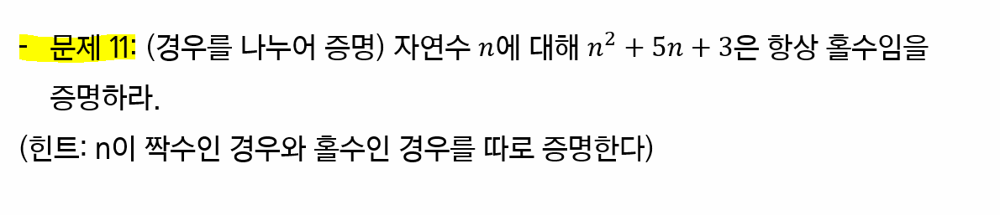
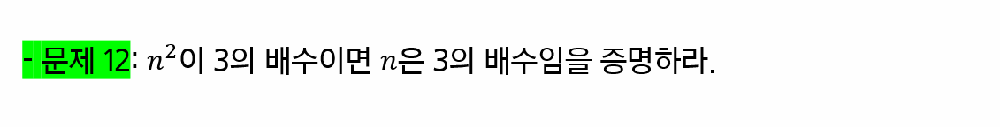

# 논리와 증명

> 페어와 함께 학습하고 고민하고 설명하며 작은 부분 하나라도 '내 것'으로 만들어보세요. 😁

**이 과정은 왜 배우냐면요..🐱‍🏍**

1. 컴퓨터공학과에서 어떤 주제로 학습을 하는지 경험해 볼 수 있습니다.
2. 느낌에 의존하는 것이 아닌 명확한 근거를 기반으로 사고하는 것이 어떤 것인지 체험해 볼 수 있습니다.

3. 개발자가 되기 위해 필요한 기본적인 수학적 지식을 가볍게 체험해 볼 수 있습니다.

**아래의 규칙을 지켜주시면 모두에게 더욱 더 유익한 학습이 될 것 같아요. 👍**

1. 학습한 내용을 직접 손으로 작성하거나 테블릿 등을 활용하여 작성한 내용을 이미지로 첨부하여 올려주시면 다른 분들이 참고 하실 때 훨씬 직관적으로 확인할 수 있을거에요!

2. 어떤 자료를 참고했고 어떤 과정을 통해 이 결과를 얻어 냈는지 조금 더 구체적으로 작성한다면 더 좋겠죠?!
   - 여러 분들의 교재를 기반으로 1차 학습
   - 추가 자료를 서칭하여 2차 학습
   - 이 과정에서 페어와 함께 의논하며 3차 학습 
     - 다른 조와의 대화도 아주 좋죠!
   - 이를 기반으로 같이 하나의 공동 문서를 작성하며 정리 

부디 이 과정에 스트레스 받지 마시고 페어와 함께 공부하며 만들어 간다는 마음으로 재밌게 학습하셨으면 좋겠습니다.  해설은 금요일 오전 라이브 수업을 통해 진행합니다.

## 1-2 번

## 2-2 번  

## 3-2 번

## 4-2 번

## 5-2 번

# 7번

## 9번

## 10번

## 11번

## 12번

